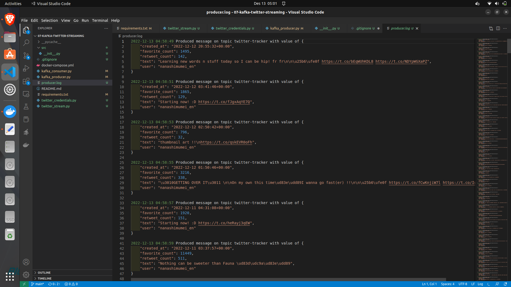

# 07-kafka-twitter-streaming

This is a simple example of how to use Kafka to stream tweets from Twitter's API.

## How to run

1. Clone the repository
```bash
git clone https://github.com/df8-naufal-aldy-pradana/07-kafka-twitter-streaming.git
```

2. Change the twitter credential used for auth on src/twitter_credentials.py, you can get it from [here](https://developer.twitter.com/en/apps)

3. You can also change the twitter_stream.py func to fit your needs better, you can find the documentation [here](https://developer.twitter.com/en/docs/tweets/filter-realtime/api-reference/post-statuses-filter)

4. Create virtual environment
```bash
python3.10 -m venv --without-pip env
source env/bin/activate
pip install -r requirements.txt
```

5. Run docker-compose to start the kafka and zookeeper
```bash
docker-compose up
```

6. Run the producer
```bash
python kafka_producer.py
```

7. Run the consumer
```bash
python kafka_consumer.py
```

## Success Scenario

1. The producer will start streaming the tweets from twitter's API


2. The consumer will start consuming the tweets from the producer


3. Producer will produce log 




